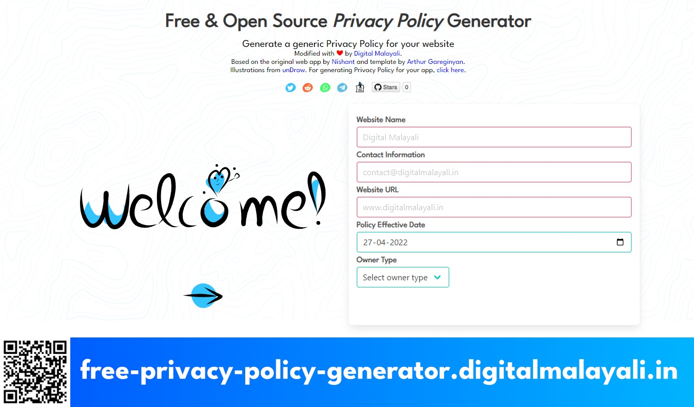
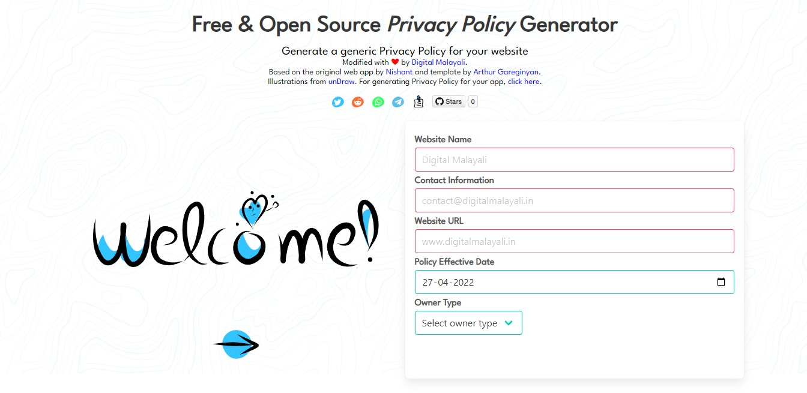
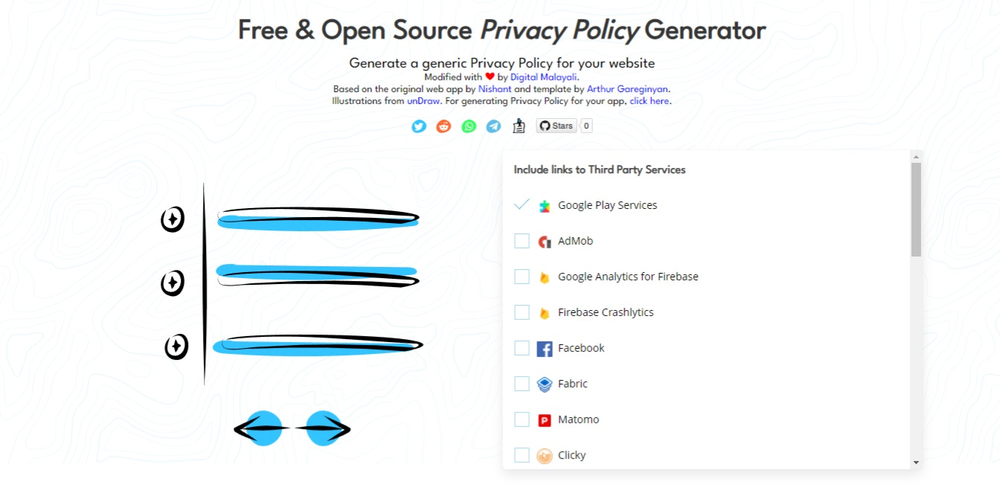
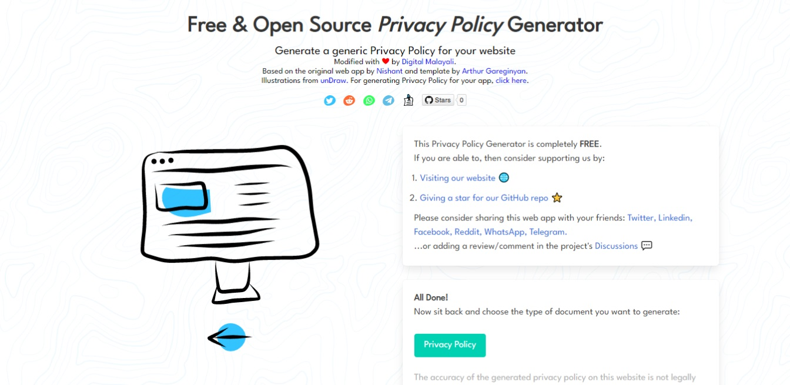

  

<strong>
  <em>A simple web app to generate a generic privacy policy for your website</em>
</strong> 
<a href="https://free-privacy-policy-generator.digitalmalayali.in/">Click here to access the webapp online</a>.
  
  
For generating privacy policy for apps, <a href="https://app-privacy-policy-generator.nisrulz.com/">click here</a> instead.

 

## Author & Contributors 🙏

This project is a modified version of the original web app by [Nishant Srivastava](https://github.com/nisrulz/nisrulz.github.io#nishant-srivastava) and template written by [Arthur Gareginyan](https://github.com/ArthurGareginyan/privacy-policy-template). Please consider supporting them.

Illustrations by Katerina Limpitsouni via [unDraw](https://undraw.co/).

## Ways You Can Help/Support this project 💕

- **Star** this repository and tell all your friends about it.
- **Watch** for new releases to get an update if something happens.
- [**Open an Issue**](https://github.com/digitalmalayali/free-website-or-app-privacy-policy-generator/issues/new/choose) if you catch any error in copy text or within the project itself.
- **Open a Pull Request** to include support for adding more 3rd party service's links or fixes against [existing issues](https://github.com/digitalmalayali/free-website-or-app-privacy-policy-generator/issues).

- Tell us you like this project or how it helped you out!

  - [Comment in the project's discussions](https://github.com/digitalmalayali/free-website-or-app-privacy-policy-generator/discussions) :blush:,
  - Reach out on [Twitter](https://twitter.com/digimalayali),
  - or [send us a nice email](mailto:contact@digitalmalayali.in)!

Thanks for your interest in this :heart:

## Screenshots 💻

## License 📝

[GNU Affero General Public License v3.0](LICENSE)

© Copyright 2022 Digital Malayali, Nishant Srivastava, Arthur Gareginyan
